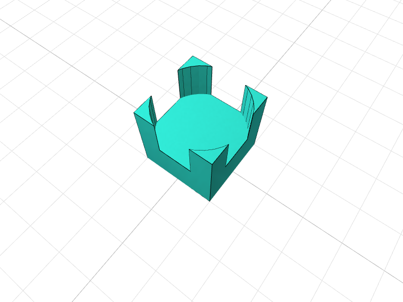

# default script 1



A CADit parametric 3D model.

> 🔧 This is a [CADit](https://cadit.app) script package - a parametric 3D model you can customize and 3D print.
> 
> Open this design in [CADit](https://cadit.app) to customize parameters, preview in 3D, and export for 3D printing.

## Installation

```bash
npm install @cadit-app/default-script-1
```

## Usage

```typescript
import { main } from '@cadit-app/default-script-1';

// Call main() to generate the 3D model
const geometry = main({ /* parameters */ });
```

## License

[MIT License](https://opensource.org/licenses/MIT)

---

<p align="center">
  <sub>Created with <a href="https://cadit.app">CADit</a> - The open parametric CAD platform for 3D printing</sub>
</p>
